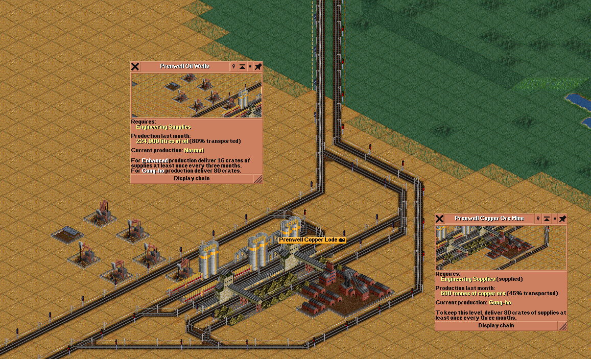

# TycoonLE OpenTTD

TycoonLE OpenTTD is the real OpenTTD/FIRS backend for TycoonLE sim-to-real evaluation. Use the JAX/Jumanji TycoonLE environment for scalable PPO training and TycoonBench; use this repo to validate policies, heuristics, and benchmark ideas against actual OpenTTD/FIRS behavior.

This backend launches real OpenTTD, installs the bundled GameScript/NoAI bridge assets, executes macro-actions in the live game through the Admin Port path, and writes research artifacts for audit and replay.

Related repositories:

- Fast JAX/Jumanji simulator: [vrtnis/tycoon-learning-environment](https://github.com/vrtnis/tycoon-learning-environment)
- Real OpenTTD/FIRS backend: [vrtnis/tycoon-learning-environment-openttd](https://github.com/vrtnis/tycoon-learning-environment-openttd)

## Example OpenTTD/FIRS State



A real OpenTTD/FIRS example state with industry windows, production, supply requirements, stations, vehicles, and transported cargo visible. TycoonLE OpenTTD uses this kind of live-game state to validate workbook scenarios, heuristic policies, and sim-to-real assumptions against actual OpenTTD/FIRS behavior.

## Install

Use Python 3.11 or newer:

```powershell
py -3.12 -m venv .venv
.\.venv\Scripts\python.exe -m pip install -e ".[gymnasium,dev]"
```

Install OpenTTD separately and make it discoverable either on `PATH` or with:

```powershell
$env:OPENTTD_EXECUTABLE="C:\path\to\openttd.exe"
```

Install FIRS through OpenTTD's Online Content UI. OpenGFX is also required; this repo can download OpenGFX for local OpenTTD user dirs when running bridge commands.

The preferred CLI command is:

```powershell
tycoonle-openttd --version
```

The `openttd-le` command is also installed as a short alias. The Python import package is `openttd_le`.

## Quickstart

Create a FIRS workbook:

```powershell
tycoonle-openttd firs-init-workbook --config configs/firs_basic.toml --out scenario.xlsx
```

Run the no-API-key heuristic path against real OpenTTD/FIRS:

```powershell
$env:OPENTTD_USER_DIR="$PWD\.openttd"
tycoonle-openttd eval --scenario lab_raw_to_processor --agent heuristic --workbook scenario.xlsx --openttd-user-dir .openttd --out runs_openttd
```

List benchmark tasks without launching OpenTTD:

```powershell
tycoonle-openttd list-openttd-scenarios
```

Use an API-backed baseline only when an API key is configured:

```powershell
$env:OPENAI_API_KEY="..."
tycoonle-openttd eval --scenario lab_raw_to_processor --model gpt-5.5 --workbook scenario.xlsx --openttd-user-dir .openttd --out runs_openttd
```

## Native API

```python
from openttd_le.envs import OpenTTDFIRSEnv

env = OpenTTDFIRSEnv(
    workbook="scenario.xlsx",
    task_id="lab_raw_to_processor",
    openttd_user_dir=".openttd",
    seed=1,
)
obs, info = env.reset()
action = info["candidate_actions"][0]["action"]
obs, reward, terminated, truncated, info = env.step(action)
env.close()
```

The Python package is imported as `openttd_le`.

## Macro-Actions

The real FIRS environment accepts macro-actions such as:

```python
{"type": "build_cargo_route", "source_id": 29, "destination_id": 12, "cargo_id": 2, "vehicles": 5}
{"type": "wait_months", "months": 1}
{"type": "add_vehicles", "route_id": "route_1", "count": 1}
{"type": "inspect_bottlenecks"}
```

`candidate_actions` are suggestions exposed in observations and `info`. The environment does not choose them for the agent.

## Gymnasium

```python
from openttd_le.adapters.gymnasium import OpenTTDFIRSGymEnv

env = OpenTTDFIRSGymEnv(
    workbook="scenario.xlsx",
    task_id="lab_raw_to_processor",
    openttd_user_dir=".openttd",
    max_candidates=24,
)
obs, info = env.reset(seed=1)
action_mask = info["action_mask"]
obs, reward, terminated, truncated, info = env.step(0)
env.close()
```

Registered Gymnasium IDs:

- `OpenTTD-FIRS-Lab-v0`: real OpenTTD/FIRS, launches OpenTTD on `reset()`.
- `OpenTTD-FIRS-Deterministic-v0`: real OpenTTD/FIRS with normalized deterministic API observations.
- `OpenTTDLE-Toy-v0`: mock backend for CI and interface debugging.

The FIRS adapter exposes `Discrete(max_candidates)` over the current macro-action frontier. Rich OpenTTD state remains in `info["native_observation"]`; `info["candidate_actions"]` and `info["action_mask"]` are the masked-action control surface.

Validate the adapter contract without OpenTTD:

```powershell
tycoonle-openttd check-gym-env --backend toy
```

Validate against real OpenTTD only when OpenTTD and FIRS are configured:

```powershell
tycoonle-openttd check-gym-env --backend openttd --scenario lab_raw_to_processor --workbook scenario.xlsx --openttd-user-dir .openttd
```

## RL Evaluation

This repo supports Gymnasium, DQN, and MaskablePPO harnesses for small-scale real-game training and evaluation. It is not the high-throughput PPO substrate.

Use [TycoonLE JAX](https://github.com/vrtnis/tycoon-learning-environment) for scalable PPO training, ablations, JAX vectorization, and TycoonBench. Use TycoonLE OpenTTD to check whether trained policies, scripted heuristics, and benchmark assumptions survive contact with actual OpenTTD/FIRS route construction and economy behavior.

Small real-game baselines:

```powershell
tycoonle-openttd benchmark-gym --workbook scenario.xlsx --scenario lab_raw_to_processor --openttd-user-dir .openttd --agents masked_random,first_valid,highest_production,shortest_route --seeds 1,2,3
tycoonle-openttd train-rl-baselines --workbook scenario.xlsx --scenario lab_raw_to_processor --openttd-user-dir .openttd --algorithms scripted:masked_random,scripted:first_valid --seeds 1,2 --out runs_rl
```

Install `tycoon-learning-environment-openttd[rl]` before running `dqn` or `maskable_ppo`.

## Sim-To-Real Workflow

1. Train and ablate policies in the JAX/Jumanji TycoonLE simulator.
2. Export policies or decision rules that operate on candidate frontiers.
3. Re-run selected policies in TycoonLE OpenTTD with fixed seeds and workbook scenarios.
4. Compare route success, cargo delivery, profit, reward, determinism, and failure diagnostics.
5. Use the OpenTTD artifacts to refine simulator assumptions and benchmark tasks.

## Artifacts

Real runs write audit artifacts under the selected `--out` directory:

- `observations.jsonl`
- `actions.jsonl`
- `rewards.jsonl`
- `firs_trace.jsonl`
- `summary.json`
- `launch.json`
- `openttd.cfg`
- `replay.json`
- `report.xlsx`
- optional `gameplay.mp4` and accelerated video when recording is enabled

Replays can be exported and rendered later:

```powershell
tycoonle-openttd export-replay --run runs_openttd/<timestamp>_firs_research
tycoonle-openttd play-replay --replay runs_openttd/<timestamp>_firs_research/replay.json --workbook scenario.xlsx --out runs_replay
```

## Determinism And Validity

Default unit tests and toy Gym checks do not require OpenTTD. Real OpenTTD checks are opt-in through configured executable and assets.

```powershell
tycoonle-openttd determinism-check --workbook scenario.xlsx --scenario lab_raw_to_processor --openttd-user-dir .openttd --agent first_valid --seed 1 --repeats 3 --max-steps 3
tycoonle-openttd benchmark-validity-pack --workbook scenario.xlsx --openttd-user-dir .openttd --out runs_validity
```

The validity pack combines repeated traces, Gym baselines, throughput measurements, and route-builder reliability checks. It writes `validity_report.json`, `benchmark_report.md`, CSV tables, and curves when training data is available.

## Bridge Assets

OpenTTD bridge assets live in `openttd_bridge/`:

- `OpenTTDLEGameScript`: GameScript/Admin Port bridge.
- `OpenTTDLECompany`: passive company holder for GameScript control.
- `OpenTTDLEBridge`: legacy NoAI visual bridge.

These assets are included in package data so installed environments can copy them into the OpenTTD user directory.

## Tests

Run lightweight tests without launching OpenTTD:

```powershell
.\.venv\Scripts\python.exe -m pytest -q
```

OpenTTD integration commands should be run only with `OPENTTD_EXECUTABLE`, FIRS, and a local OpenTTD user directory configured.

## Credits

TycoonLE OpenTTD builds on [OpenTTD](https://www.openttd.org/) and the OpenTTD GameScript, NoAI, and Admin Port APIs. FIRS industry support depends on [FIRS Industry Replacement Set](https://grf.farm/firs/). Graphics for real OpenTTD runs use [OpenGFX](https://github.com/OpenTTD/OpenGFX), the open-source base graphics set for OpenTTD.
